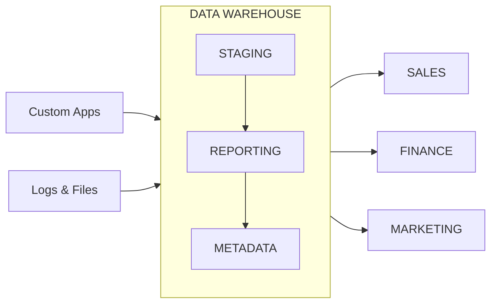

 # Exploratory Data Analysis — Job market analytics with SQL

📊 Job Market Analytics — Data Engineering Roles
A SQL-based exploratory data analysis project built on real-world job posting data, designed around a star schema data warehouse. This project demonstrates my ability to write production-quality analytical SQL, design efficient queries, and translate business questions into actionable, data-driven insights.
🔍 What This Project Covers

Identifying the most in-demand skills for data engineering roles
Analyzing salary patterns across job titles and locations
Discovering optimal skill combinations that maximize earning potential
Structuring queries for clarity, performance, and reusability

A star schema data warehouse design used to extract insights on skill demand, salary patterns, and optimal skill combinations for data engineering roles.

Schema structure

Fact table — job_postings_fact

Central table containing job posting details — titles, locations, salaries, dates, and more.

Dimension tables

company_dim Company information linked to job postings
skills_dim Skills catalog with skill names and types
Bridge table — skills_job_dim

Resolves the many-to-many relationship between job postings and skills.

Starting off my first project on data engineering

## Exceutive Summary

## Executive Summary

- ✅ **Project Scope:** Developed three analytical queries to address critical questions within the data engineering job market  
- ✅ **Data Modeling:** Leveraged multi-table joins across fact and dimension tables to generate meaningful insights  
- ✅ **Analytics:** Applied aggregations, filtering, and sorting to identify top skills based on demand, salary, and overall value  
- ✅ **Outcomes:** Produced actionable insights highlighting the dominance of SQL/Python, emerging cloud trends, and salary patterns  

📂 [View SQL Queries](1.9_EDAsql)

## Problem & Context

## Tech Stock
